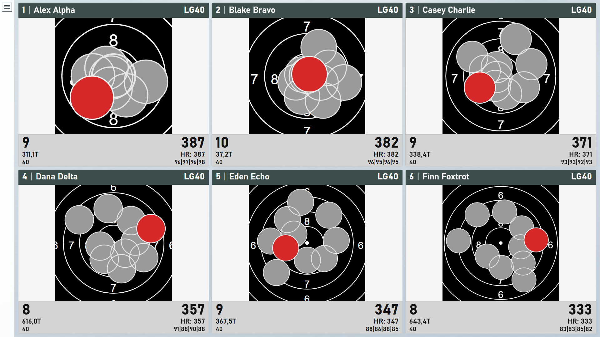
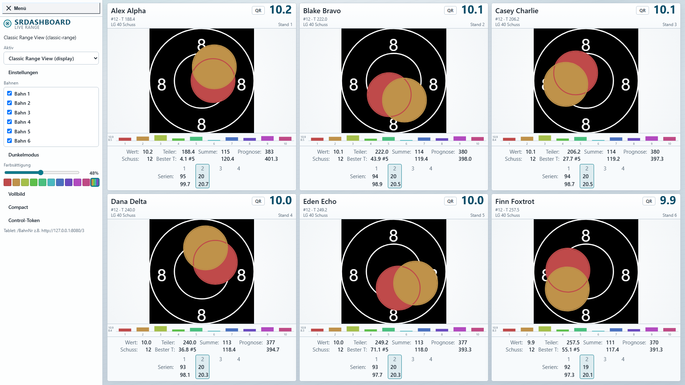
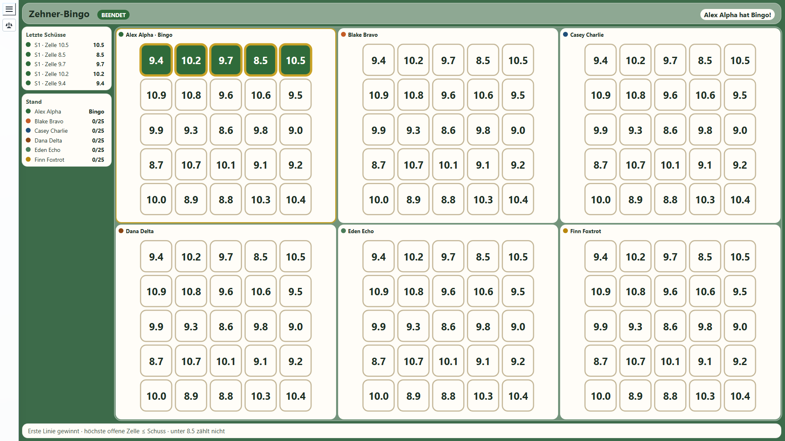
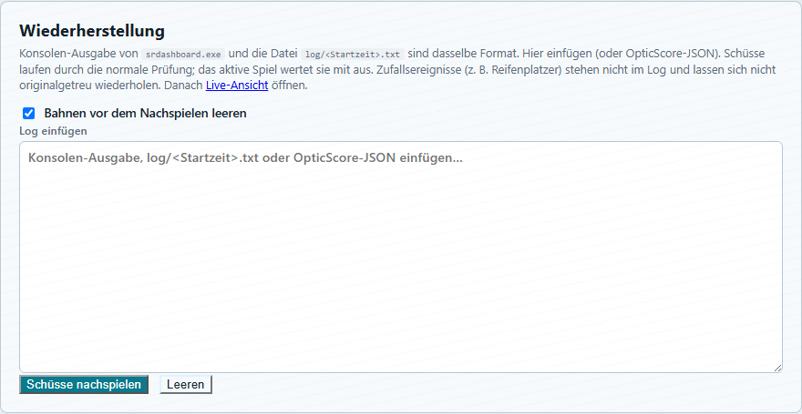

# SRDashboard

Live hall display for **DISAG OpticScore**. It shows every stand on a large screen (or one stand on a tablet), plots shots on the target, and can switch from the classic range view into game plugins.

**Stack:** Go HTTP/WebSocket server + vanilla JS frontend. **License:** [AGPL-3.0](LICENSE). **Release:** [v0.3](CHANGELOG.md).

Comments at the [meisterschuetzen.org](https://meisterschuetzen.org) forum or here.

---

## Classic Range

The default plugin is **Classic Range View** — a competition display for air rifle, air pistol and 50 m smallbore.


Each lane shows:

- ISSF-style **target** with live pellet holes (last shot highlighted)
- Shooter name, discipline and stand number
- **Current shot** value (large chip in the header)
- Footer stats: Wert, **Teiler** (and best Teiler), Summe (integer + decimal), **Prognose** for the remaining programme, Schuss number
- **Serien** columns — click a series to put those shots back on the scheibe
- **Last-10** bar chart under the target
- Idle stands can be hidden so active lanes get more space
- Mixed disciplines per range (LG / LP / KK faces from OpticScore)

The same view on a stand tablet (`/1`, `/2`, …):


**Classic Range Condensed** especially for Daniel, who has ears like a bat but the eyes of a mole, is the same live hall without the last-10 chart or the full stats table — header, target, last shot, Teiler, Summe and Serien only. Switch to it from **Menü**.



Open **Einstellungen** (`/config`) to toggle footer fields, pellet outline width, lane count and per-plugin target faces.

The side **Menü** also sets **Farbsättigung** and pellet fill: rainbow (default) or one hue from light to deep, plus **Compact** for the hall without the target disc.



---


## Ring Reader QR

Every stand with shots has a **QR** button in the lane header. It encodes the current result for [Ring Reader](https://ringreader.app) (`https://ringreader.app/import/qr#…`).


1. Finish (or pause) the series on OpticScore.
2. Tap **QR** on that stand.
3. Scan the code with a phone — Ring Reader imports warmup and competition shots (series split every 10, same as the Wertung).

The dialog can also show the JSON payload (debug / copy). PNG and metadata are available at `/api/qr.png?range=N&fmt=rr` if you need the code outside the UI.

The hall overlay looks like this when a QR is open:


---


## Game plugins

Switch the active plugin from the master **Menü**. Shared games use one hall layout plus per-stand tablets. After Einschießen, **Start** (or auto-start when every stand is ready). Tap **Regeln** on the master display for the full rulebook of the active game.

Several games also score a **hole-in-hole**: at least 50 % overlap with that lane’s last scoring shot, and a raw value above 8.5. Mixed-ability fields are balanced with personal par, calibration, or handicap — never by asking anyone to aim off centre.

### Autorennen

All lanes race the same circuit. Each Wertungsschuss is a push — higher rings mean more pace, and a run of 9s and 10s can add a short extra burst. Skip a lap and you stand still; skip two and you retire.

Every ten shots there is a 5-second box window: the stop-shot’s value and reaction gain or lose places, and a zero in the box costs a place. Marked DRS stretches make overtaking easier, especially from further back. Random field events (puncture, oil) send a car to the pits. A hole-in-hole gives a small bonus push. First across the line wins.


### Fox on the Run (Fuchsjagd)

Each stand is fox once; the others are the pack. Five calibration shots set an equalizer so mixed fields hunt in the same Revier. The fox opens with two Vorwürfe for a start lead, then hunters and fox shoot in turn — only the stand whose turn it is counts. Hunter shots close the gap, fox shots widen it.

Vorsprung 30: the fox reaches the Bau and escapes. Vorsprung 0: the fox is caught. The evening ranks how often each shooter escaped as fox, and how close the hunts were.


### Tannebaum Einzel

Each stand has its own kegel tree in three stages: whole rings 5–10, half rings 8.0–10.0, then tenths 10.5–10.9. A shot always tries the most precise still-open needle it can reach (C before B before A). If that needle is already gone on your tree, the same value falls as a **Geschenk** on another stand that still needs it. Below 5, or with nothing left to hit, is a miss.

First empty tree wins.


### Tannebaum Team

Same needle rules as Einzel, but two teams share one tree each (odd/even stands by default, configurable). A shot clears the most precise open needle on your team’s tree; if that value is already gone, it is a gift onto the other team’s tree.

The team that empties its tree first wins.


### Ludo

One hat per stand, all starting in the Hof. **10.0** (or better) enters onto your start cell — and sends anyone sitting there back to the Hof. **9.0–10.4** move one cell, **10.5+** two. 6 and 7 do nothing.

Landing on an occupied cell sends that hat back; jumping over without landing does not. After one lap come four house cells: there is no exact-count (overshoots are clipped) and no capturing in the house. First to fill the house wins.


### Barrikade

Everyone runs the same track to the Burg (cell 25). Move rules match Ludo: **9+** one cell, **10.5+** two, below 9 stay put. Walls sit on fixed slots; three start on the path. A wall immediately ahead blocks you unless the shot is at least **10.0**, which lifts it, drops it on the next free slot behind you, and then still moves you.

First to the Burg wins.


### Zehner-Bingo

Every stand plays the same 5×5 card of tenths from 8.5 to 10.9, shuffled at match start. A shot marks the highest still-open cell it can reach (the value must be at least the cell). Below 8.5 marks nothing. A 9.2 can take an open 9.0 but not a 9.5; a 10.9 can take any remaining cell and takes the highest.

First full line (row, column, or diagonal) wins. Optional full-card mode requires all 25 cells.


On `/compact` the cards keep the leftover space; the target disc is omitted.



### Tauziehen

Two teams (odd vs even stands) pull one rope. Five calibration shots set each shooter’s personal par. When a round is complete, shots above par pull toward your side by the difference; shots below slip the rope back. A hole-in-hole adds extra pull and never hurts. Uneven team sizes are averaged so a larger team does not win by headcount.

Reach the rope mark, or after the last round the side the rope sits on wins.

### Kettenreaktion

A fixed shot programme, free-fire. Base points are the (handicap-adjusted) ring value. A shot above 8.5 starts a chain; each following hole-in-hole lengthens it and multiplies the next shot. Any other shot breaks the chain, unless that lane still has a chain protection left.

Highest total wins; longest chain is the tiebreak.

### Biathlon

Five calibration shots set a personal hit threshold. Then four stages of five targets. A shot at or above your threshold clears the next open disc; a miss adds penalty seconds. A hole-in-hole clears the target and shaves time. The clock includes real time between shots, so waiting on the firing point costs you.

Lowest total time (elapsed plus penalties) wins.

### Schrumpfender Kreis

Calibration sets each lane’s starting value floor. Every round the required value climbs. Meet it and you stay; miss it and you lose a life, and you are out at zero. A hole-in-hole can restore a life (up to the cap).

Last lane standing wins. If several survive the last round, the highest total value decides.

### Kronen-Duell

The first scoring shot takes the crown. The bar to beat is the holder’s last effective value, decaying with every shot in the field down to a floor. Beat the bar to steal the crown, or steal it instantly with a hole-in-hole. Hold time accrues while you wear it.

Most crown time when the match clock runs out wins.

### Bank oder Risiko

Five calibration shots set a personal floor. Each shot adds its value to an unbanked pot. Bank from the stand tablet to lock the pot into your score; a shot below your floor wipes the pot. A hole-in-hole multiplies the pot. Whatever is still unbanked at the end of the programme is lost.

Highest banked total wins.

### KO-Pokal

A short qualifying round seeds a knockout bracket. Duels then play one at a time on the hall screen: both shoot once per point, higher effective value takes it, a hole-in-hole takes it outright, a tie replays. First to the configured point total advances. Non-power-of-two fields get byes; an optional third-place match follows.

The bracket champion wins.

### Schießgolf

Nine holes, all lanes on the same hole at once. Each shot is a stroke: the ring value (above a floor) is how far the ball travels toward the pin. Once you are at the pin, holing out needs **10.5+** or a hole-in-hole.

Lowest net (gross strokes minus handicap strokes) wins.

### Turmbau

A fixed shot programme. Each shot stacks a block; a value above 8.5 stacks two, a hole-in-hole stacks three and reduces lean. Lean grows with that shot’s own Teiler (distance from centre). Exceed the tip tolerance and the tower collapses — that lane’s height freezes there.

Tallest tower wins, standing or at the moment it fell.

### Ansage-Duell

Before each round, pick a contract from the stand tablet. Contracts are relative to your own par (for example average at least par + 0.5, or land a hole-in-hole). Deliver it and you take the bid points; fail and you lose a fraction of that reward.

Highest points after all rounds wins.

---


## Session recovery

If the dashboard was restarted mid-match, **Einstellungen → Wiederherstellung** replays shots from the console log (`log/<start-time>.txt`) or pasted OpticScore JSON. Shots go through the same UDP checks as live fire; the active game scores them again. Random field events (for example a puncture in Autorennen) are not in the log and will not repeat.



---


## Windows installation

You need a Windows PC on the same network as OpticScore (hall PC or a dedicated display PC).

1. Copy the Windows package so these stay **in the same folder**:
  - `srdashboard.exe`
  - `config.xml`
  - `plugins\` (one folder per plugin, not zip files)
   A pre-built tree lives at `[dist/windows-amd64/](dist/windows-amd64/)` in this repo. You can copy that folder to e.g. `C:\SRDashboard`.
2. Double-click `srdashboard.exe`.
  If Windows Firewall asks, allow it on the **private** range network.
3. Open a browser on the display PC: **[http://localhost:8080](http://localhost:8080)**
4. In **DISAG OpticScore**, enable **JSON Live** and send it to this PC on UDP port **30169** (the default in `config.xml`). As soon as a stand fires, the matching panel fills.
5. Tablets / extra screens on the LAN:
  - Hall grid: `http://<pc-ip>:8080`
  - Compact hall (no target disc): `http://<pc-ip>:8080/compact`
  - Stand 1: `http://<pc-ip>:8080/1` (same for `/2`, `/3`, …)
  - Settings: `http://<pc-ip>:8080/config`

Optional: listen on another HTTP port with an environment variable, then start the exe from that same prompt:

```bat
set PORT=9090
srdashboard.exe
```

Pass a custom config path as the first argument: `srdashboard.exe D:\range\config.xml`.

### Admin vs public HTTP ports


| Port                         | Config                                        | Role                                                                                                                            |
| ---------------------------- | --------------------------------------------- | ------------------------------------------------------------------------------------------------------------------------------- |
| **Admin** (default **8080**) | `display/adminPort` (or `PORT` env)           | Full control: master, stands, `/config`, plugin switch, live reset. On the controlled hall LAN an empty `controlToken` is fine. |
| **Public** (optional)        | `display/publicPort` — `0` = off, e.g. `8081` | Read-only **master + stands**. No `/config`, no mutations. Safe to put behind a reverse proxy / publish elsewhere.              |


Example — enable the public view port in `config.xml`:

```xml
<display>
  <adminPort>8080</adminPort>
  <publicPort>8081</publicPort>
  …
</display>
```

Then publish **only** `:8081` (rate limits / TLS at the reverse proxy). Keep `:8080` and UDP on the private range network.

On a network that is not only the range LAN **and** you only use the admin port, set `display/controlToken` in `config.xml` (or in Einstellungen) so random visitors cannot change plugins or reset scores.

---


## Displays


| URL                                 | Role                                                                            |
| ----------------------------------- | ------------------------------------------------------------------------------- |
| `/?display=master`                  | All ranges (default)                                                            |
| `/compact` or `/?display=compact`   | Compact hall without the target disc (board/trees/cards use the leftover space) |
| `/?display=shooter&range=2` or `/2` | Single-range tablet                                                             |
| `/config`                           | Site + plugin settings (**admin port only**)                                    |
| `GET /api/mode`                     | `{ "role": "admin" }` or `{ "role": "public" }`                                 |


---


## Developers


### Prerequisites

- Go 1.24+ ([go.dev/dl](https://go.dev/dl/))
- OpticScore JSON Live on UDP **30169** (or synthetic shots via `go run ./cmd/send-shot`)


### Build & run

```bash
go build -o srdashboard.exe .
./srdashboard.exe
```

```bash
go test ./...
go test ./host/fullplay
python scripts/ui_regression.py
```

`host/fullplay` plays every bundled game to a finish. `python scripts/ui_regression.py` is the UI check that was ordered: a **complete game of each plugin** at **1920×1080**, screenshot hall (including menu open) + shooter, fail leftover-space scrollbars. Needs a running `./srdashboard.exe`.

Raspberry Pi / ARM:

```powershell
.\scripts\build-arm64.ps1
```

Pre-built binaries: `dist/windows-amd64/`, `dist/linux-amd64/`, `dist/linux-arm64/`.

OpticScore JSON is parsed in `udp/`, live state in `state/`, game logic in `host/games/`, plugin views in `plugins/{id}/`, Ring Reader encoding in `qrformat/`.

Shot fields (coordinates → Teiler → DecValue → IntValue) and the LG/LP/KK Teiler tables: [docs/shot-scoring.md](docs/shot-scoring.md).

---


## License

Copyright (C) 2026 the SRDashboard authors.

By contributing, you agree that your contributions are licensed under AGPL-3.0 and that all rights in those contributions are granted to the SRDashboard project. See **Contributions** in [LICENSE](LICENSE).

This program is free software under the GNU Affero General Public License v3.0 or later. It is distributed without warranty. See [LICENSE](LICENSE) for details.