# SRDashboard

Live hall display for **DISAG OpticScore**. It shows every stand on a large screen (or one stand on a tablet), plots shots on the target, and can switch from the classic range view into game plugins.

**Stack:** Go HTTP/WebSocket server + vanilla JS frontend. **License:** [AGPL-3.0](LICENSE).

---

## Classic Range

The default plugin is **Classic Range View** — a competition display for air rifle, air pistol and 50 m smallbore.

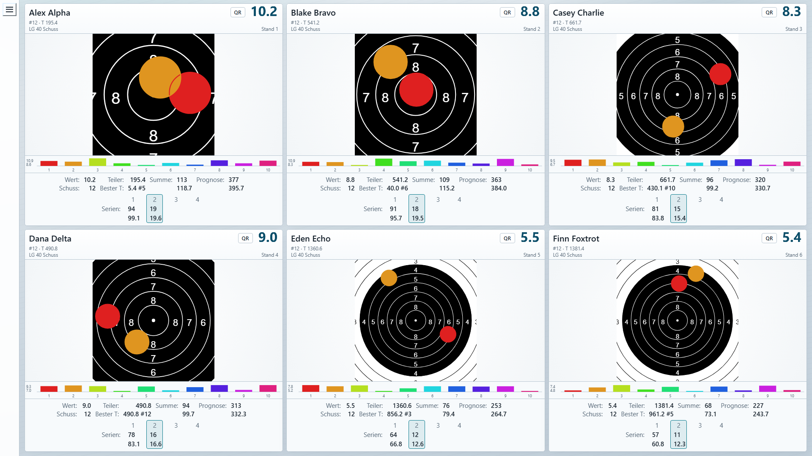

Each lane shows:

- ISSF-style **target** with live pellet holes (last shot highlighted)
- Shooter name, discipline and stand number
- **Current shot** value (large chip in the header)
- Footer stats: Wert, **Teiler** (and best Teiler), Summe (integer + decimal), **Prognose** for the remaining programme, Schuss number
- **Serien** columns — click a series to put those shots back on the scheibe
- **Last-10** bar chart under the target
- Idle stands can be hidden so active lanes get more space
- Mixed disciplines per range (LG / LP / KK faces from OpticScore)

The same view on a stand tablet (`/1`, `/2`, …):

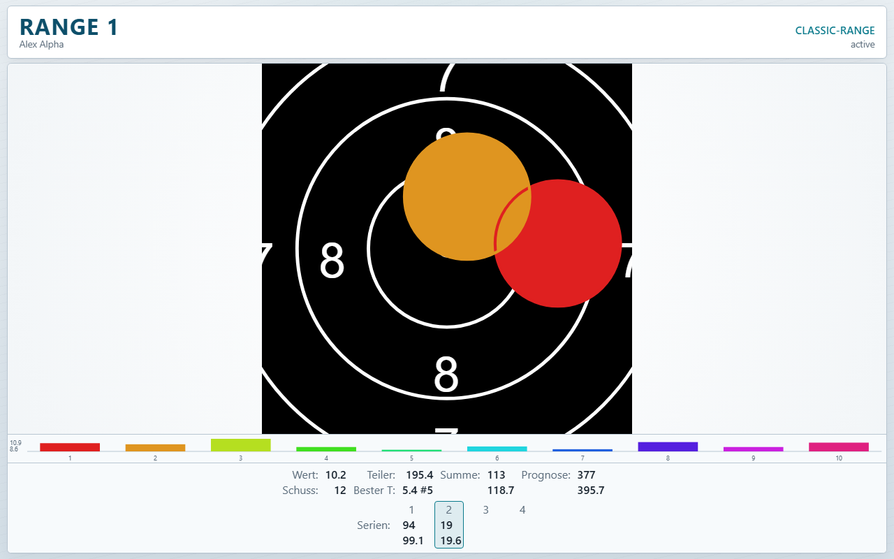

Open **Einstellungen** (`/config`) to toggle footer fields, pellet outline width, lane count and per-plugin target faces.

---

## Ring Reader QR

Every stand with shots has a **QR** button in the lane header. It encodes the current result for [Ring Reader](https://ringreader.app) (`https://ringreader.app/import/qr#…`).

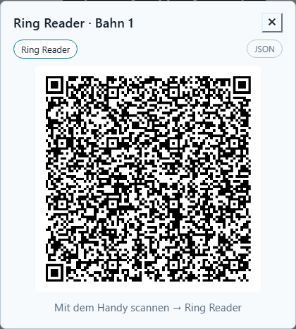

1. Finish (or pause) the series on OpticScore.
2. Tap **QR** on that stand.
3. Scan the code with a phone — Ring Reader imports warmup and competition shots (series split every 10, same as the Wertung).

The dialog can also show the JSON payload (debug / copy). PNG and metadata are available at `/api/qr.png?range=N&fmt=rr` if you need the code outside the UI.

The hall overlay looks like this when a QR is open:

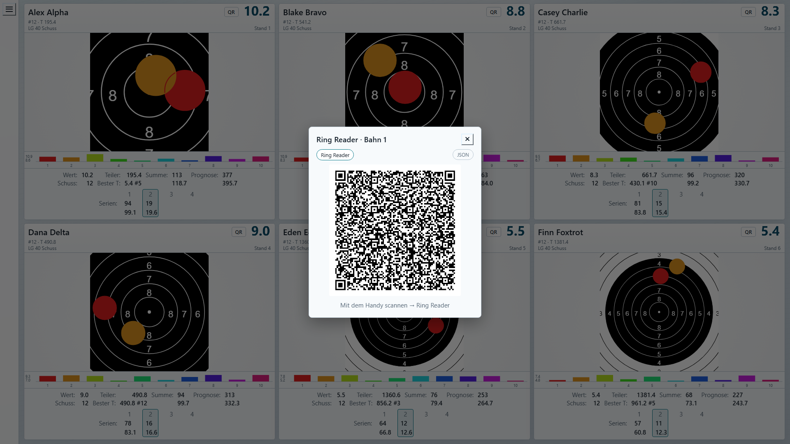

---

## Game plugins

Switch the active plugin from the master **Menü** (plugin dropdown). Shared games use one hall layout plus per-stand tablets. After Einschießen, **Start** (or auto-start when every stand is ready).

### Autorennen

Mehrbahn race on a circuit. Each Wertungsschuss pushes the car — higher rings mean more pace. Boxenstopps every ten shots, DRS overtake zones, optional field events (puncture / oil).

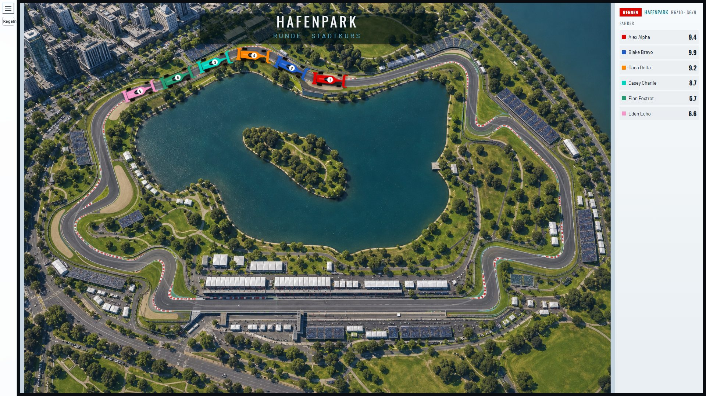

### Fox on the Run (Fuchsjagd)

Each stand is fox once; the pack hunts the lead. Calibration shots set an equalizer, then hunters and fox shoot in turn. Reach the Bau to escape, or get caught at Vorsprung 0.

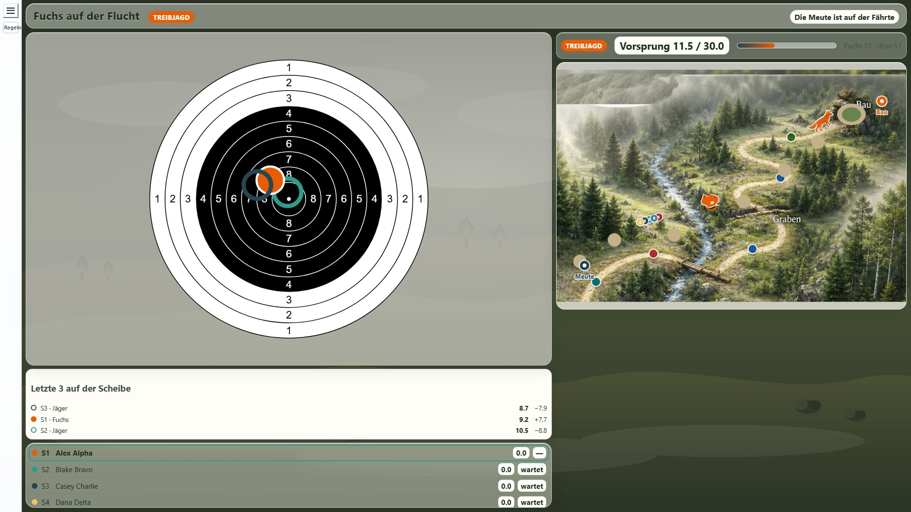

### Tannebaum Einzel

Each stand clears its own kegel tree (stages A / B / C). Hits on a value you already cleared become a **Geschenk** on another stand’s tree. First empty tree wins.

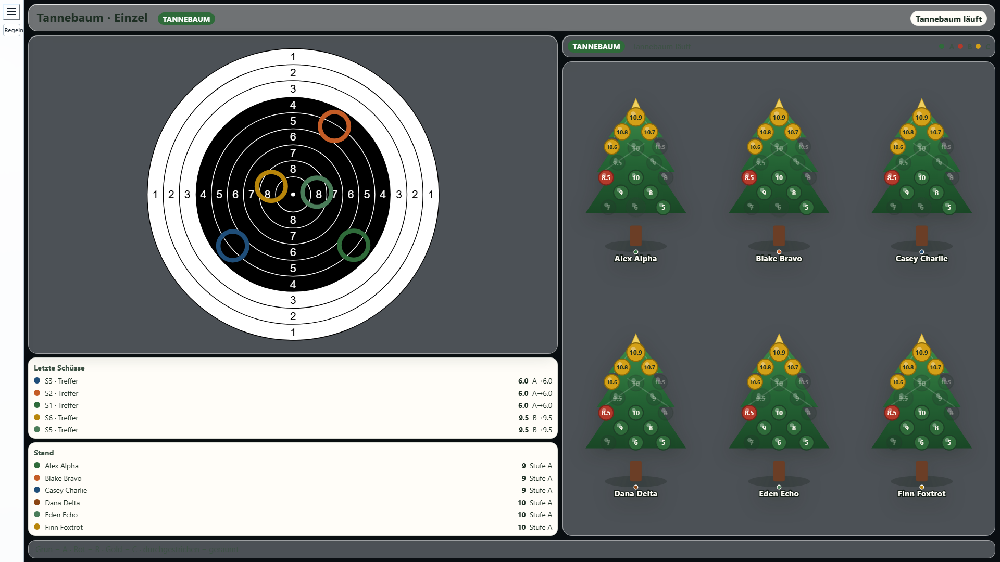

### Tannebaum Team

Two teams, one tree per side. Odd/even stands are the default split (configurable). Same needle rules as Einzel — gifts go to the other team.

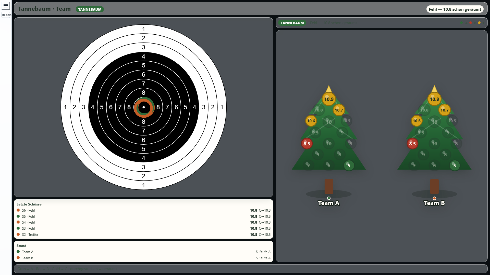

### Ludo

One hat per stand. **10.0** enters from the Hof, **9+** moves one cell, **10.5** two. Landing on someone sends them back. 6–7 do nothing. No exact-count in the house.

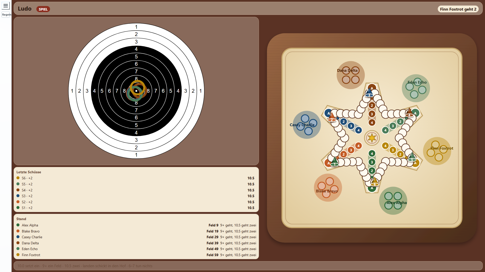

### Barrikade

Race to the Burg. Same step rules as Ludo. A wall blocks the next cell until a **10.0** lifts it and drops it behind you.

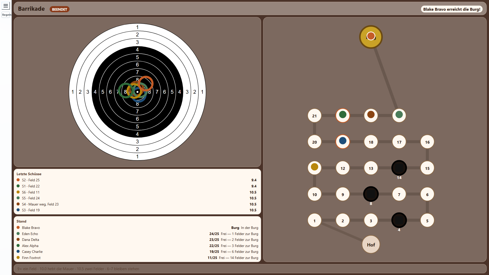

### Zehner-Bingo

A 3×3 card of high cells (9.0–10.9). A shot marks the highest still-open cell it can reach. First full line wins (optional full-card mode). 6–7 mark nothing.

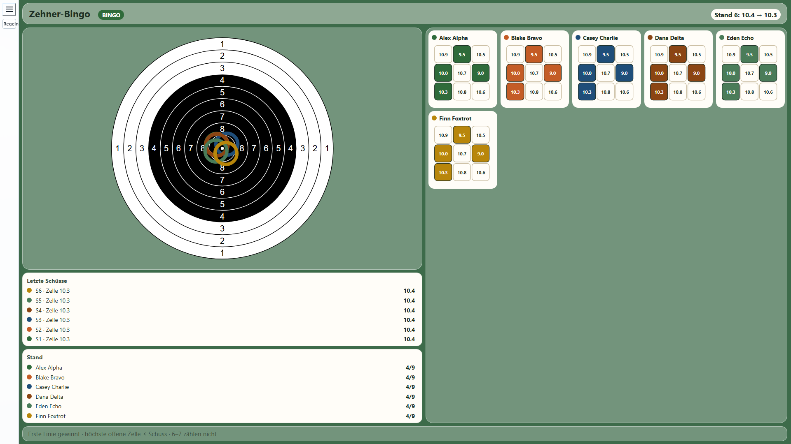

Tap **Regeln** on the master display for the in-app rulebook of the active game.

---

## Windows installation

You need a Windows PC on the same network as OpticScore (hall PC or a dedicated display PC).

1. Copy the Windows package so these stay **in the same folder**:
   - `srdashboard.exe`
   - `config.xml`
   - `plugins\`
   
   A pre-built tree lives at [`dist/windows-amd64/`](dist/windows-amd64/) in this repo. You can copy that folder to e.g. `C:\SRDashboard`.

2. Double-click `srdashboard.exe`.  
   If Windows Firewall asks, allow it on the **private** range network.

3. Open a browser on the display PC: **http://localhost:8080**

4. In **DISAG OpticScore**, enable **JSON Live** and send it to this PC on UDP port **30169** (the default in `config.xml`). As soon as a stand fires, the matching panel fills.

5. Tablets / extra screens on the LAN:
   - Hall grid: `http://<pc-ip>:8080`
   - Stand 1: `http://<pc-ip>:8080/1` (same for `/2`, `/3`, …)
   - Settings: `http://<pc-ip>:8080/config`

Optional: listen on another HTTP port with an environment variable, then start the exe from that same prompt:

```bat
set PORT=9090
srdashboard.exe
```

Pass a custom config path as the first argument: `srdashboard.exe D:\range\config.xml`.

On a network that is not only the range LAN, set `display/controlToken` in `config.xml` (or in Einstellungen) so random visitors cannot change plugins or reset scores.

---

## Displays

| URL | Role |
|-----|------|
| `/?display=master` | All ranges (default) |
| `/?display=shooter&range=2` or `/2` | Single-range tablet |
| `/config` | Site + plugin settings |

---

## Developers

### Prerequisites

- Go 1.24+ ([go.dev/dl](https://go.dev/dl/))
- OpticScore JSON Live on UDP **30169** (or synthetic shots via `go run ./cmd/send-shot`)

### Build & run

```bash
go build -o srdashboard.exe .
./srdashboard.exe
```

```bash
go test ./...
go test ./host/fullplay
python scripts/ui_regression.py
```

`host/fullplay` plays every bundled game to a finish. `python scripts/ui_regression.py` is the UI check that was ordered: a **complete game of each plugin** at **1920×1080**, screenshot hall (including menu open) + shooter, fail leftover-space scrollbars. Needs a running `./srdashboard.exe`.

Raspberry Pi / ARM:

```powershell
.\scripts\build-arm64.ps1
```

Pre-built binaries: `dist/windows-amd64/`, `dist/linux-amd64/`, `dist/linux-arm64/`.

OpticScore JSON is parsed in `udp/`, live state in `state/`, game logic in `host/games/`, plugin views in `plugins/{id}/`, Ring Reader encoding in `qrformat/`.

Shot fields (coordinates → Teiler → DecValue → IntValue) and the LG/LP/KK Teiler tables: [docs/shot-scoring.md](docs/shot-scoring.md).

---

## License

Copyright (C) 2026 the SRDashboard authors.

By contributing, you agree that your contributions are licensed under AGPL-3.0 and that all rights in those contributions are granted to the SRDashboard project. See **Contributions** in [LICENSE](LICENSE).

This program is free software under the GNU Affero General Public License v3.0 or later. It is distributed without warranty. See [LICENSE](LICENSE) for details.
