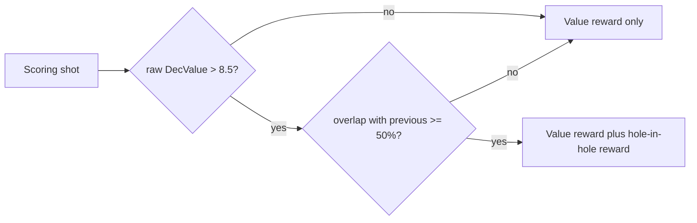
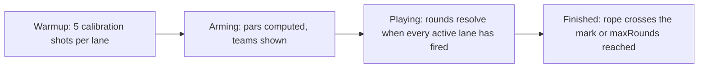

# Game concepts

Design specification for the ten competitive training games shipped as plugins. This
document fixes the rules, the shared scoring primitives and the skill-balancing model.

Existing games (Ludo, Barrikade, Zehner-Bingo, Tannebaum, Fox on the Run, Autorennen) are
not affected. See [plugin-authoring.md](plugin-authoring.md) for the plugin contract and
[shot-scoring.md](shot-scoring.md) for how Teiler, DecValue and IntValue relate.

## Design rules

These apply to every game in this document. They exist because the games are **training**
games: whatever the game rewards is what the shooter will practise.

### The two scoring currencies

A game may reward exactly two things:

1. **A higher decimal value.** More is always better, without exception.
2. **A hole-in-hole.** The shot repeats the previous one, and is itself above the value gate.

Nothing else may earn points, progress, position or advantage.

### What is forbidden

| Forbidden | Why |
|-----------|-----|
| Rewarding a specific ring ("hit exactly 8") | Trains aiming off centre |
| Rewarding a sector, quadrant or zone | Trains aiming off centre |
| Rewarding a low value, or punishing a high one | Trains aiming off centre |
| Bust / overshoot mechanics on the value itself | Makes a 10.9 a liability |
| Ring digits as symbols (codes, card ranks) | Makes a specific low ring desirable |

A useful test for any new mechanic: *if a shooter wanted to win and did not care about
training, would they ever deliberately aim away from the centre?* If yes, the mechanic is out.

### Hole-in-hole

A shot is a hole-in-hole when **both** conditions hold:

| Condition | Config key | Default |
|-----------|-----------|---------|
| Area overlap with the previous shot on the same lane | `holeInHoleMinOverlap` | `0.5` |
| Raw `DecValue`, strictly greater | `holeInHoleMinValue` | `8.5` |

The value gate uses the **raw** value, never the handicap-adjusted one. A hole-in-hole is an
absolute achievement that means the same thing on every lane, which is what makes it worth
announcing on the big screen. Because `DecValue` is quantised to tenths, `> 8.5` is exactly
`>= 8.6`.

The gate is checked on the **current** shot only, matching the existing Autorennen behaviour.
The geometry constrains the previous shot anyway: it must lie within one overlap distance of a
shot that is already inside the 8.6 band.

The previous shot is the immediately preceding **scoring** shot on the same lane. Warmup and
calibration shots neither count as a hole-in-hole nor serve as an anchor for one.

#### Geometry

Both holes are circles of the same radius `r = shotDiameterMm / 2`, converted to DSG with
`dsgPerMm`. For two equal circles, 50 % area overlap occurs at a centre distance of
`0.404 × diameter`:

| Discipline | Shot Ø | Centre distance for 50 % | In DSG |
|------------|--------|--------------------------|--------|
| LG 10 m air rifle | 4.5 mm | 1.82 mm | 182 |
| LP 10 m air pistol | 4.5 mm | 1.82 mm | 182 |
| KK 50 m | 5.6 mm | 2.26 mm | 226 |

Two consequences worth knowing when tuning a game:

- **Above a certain value the overlap is automatic.** Two LG shots of 10.7 or better are both
  inside Teiler 75, so they can be at most 1.5 mm apart and always overlap by 50 %. On LP and
  KK, where the ring pitch is 80 DSG per tenth, only a pair of 10.9s is automatic. A game that
  pays heavily for hole-in-hole is therefore noticeably more generous on air rifle than on
  pistol or smallbore.
- **At the gate itself it is demanding.** An 8.6 sits anywhere inside Teiler 600 (LG) or 1920
  (LP/KK), so hitting the same hole twice at that level is genuine work.

Per-discipline tuning of `holeInHoleMinOverlap` is the intended lever if a club finds the
reward too easy on LG.

#### Proposed shared helper

To be lifted out of [../host/games/autorennen/logic.go](../host/games/autorennen/logic.go)
(`circleOverlapRatio`, line 2006) into `gameutil` when the first game is implemented:

```go
// CircleOverlapRatio returns intersection area / area of one circle.
func CircleOverlapRatio(x1, y1, x2, y2, r float64) float64

// HoleInHole reports whether the current shot repeats the previous one on the same lane.
// dec is the RAW DecValue: the gate is deliberately not handicap-adjusted, so a
// hole-in-hole means the same thing on every lane.
func HoleInHole(prevX, prevY, x, y float64, dec float64, cfg map[string]any) (bool, float64)
```

`HoleInHole` reads `holeInHoleMinOverlap`, `holeInHoleMinValue`, `shotDiameterMm` (4.5, or 5.6
for KK) and `dsgPerMm` (100.0) from the merged plugin config, all of which already exist as
Autorennen defaults.



### Skill balancing

Mixed-ability fields are balanced by changing **what counts as good for you**, never by giving
anyone a different aiming task. Three levers, all already present in the codebase:

| Lever | Source | Use when |
|-------|--------|----------|
| Per-lane offset | `gameutil.HandicapFor` / `gameutil.Effective` ([../host/games/gameutil/util.go](../host/games/gameutil/util.go)) | The club knows its shooters and sets values by hand |
| Calibration equalizer | `computeEqualizers` ([../host/games/foxontherun/handicap.go](../host/games/foxontherun/handicap.go)) | Ad-hoc fields; five warmup shots derive a skill, the adjustment is clamped to ±2 |
| Personal par / threshold | New, per game | The game compares each shooter against themselves rather than against the field |

The third is the strongest for these designs and is simply the calibration mean stored per
lane. A beginner beating their own par by 0.4 earns the same as an expert beating theirs by 0.4.

The 8.5 value gate is the one thing that is **never** adjusted per shooter. A club may tune
`holeInHoleMinOverlap` for its discipline, but that setting applies to the whole session.

## Specification template

Each game below is described with the same fields:

- **Concept** — one sentence
- **Lanes** — supported range count and team structure
- **Flow** — phases and turn order
- **Scoring** — what each shot does, in the two allowed currencies
- **Win**
- **Balancing** — which lever, and how
- **Not gameable** — why aiming off centre never helps
- **Config** — proposed keys with defaults
- **View** — what the shared screen shows

## 1. Tug of War (Tauziehen)

Plugin id `tauziehen`, `kind="game"`, `mode="shared"`, `logic="builtin"`. **Build this one first:**
the logic is small, the rope reads instantly from across the range, and it exercises the
personal-par model that four of the other games reuse.

**Concept.** Two teams pull one rope. Every shot above your personal par pulls it your way by
the difference; every shot below pushes it back.

**Lanes.** 2–8, split into two teams. Default assignment odd lanes versus even lanes, overridable
per lane like `teamAssignments` in `tannebaum-team`. Teams may be unequal in size.

**Flow.**



Phases use the `gameutil.Phase*` constants. Calibration shots are warmup shots: they set par and
never move the rope. `autoStartWhenAllReady` moves the session from arming to playing once every
active lane has calibrated.

Play is **round-based**. A shot belongs to round `N = shotsFired + 1` on its lane, and round `N`
resolves only when every active lane has fired its `N`-th scoring shot. This keeps a fast team
from out-shooting a slow one, and it means the rope moves in visible, discrete jerks rather than
drifting continuously. Shots already fired in an unresolved round are shown as a provisional
pull on the lane card.

**Scoring.** Per shot, with `raw = gameutil.RawShotValue(dec, full)`:

| Step | Rule |
|------|------|
| Par | `par[lane]` = mean of the lane's calibration values, clamped to `[parMin, parMax]` |
| Pull | `pull = clamp(raw - par, -pullMax, +pullMax)` |
| Hole-in-hole | if `HoleInHole(...)`: `pull = max(pull, 0) + holeInHoleBonusPull` |
| Team pull | `teamPull = sum(member pulls) / activeMembers` |
| Rope | on round resolve: `rope += (pullA - pullB) * ropeScale` |

A miss needs no special case: `raw = 0` yields `-pullMax` through the clamp.

The hole-in-hole rule is written as `max(pull, 0) + bonus` rather than "double the pull" on
purpose. Doubling would punish an expert whose 9.8 hole-in-hole sits below a par of 10.1, which
would be absurd — a hole-in-hole must never cost you anything.

**Win.** Rope reaches `+ropeTarget` (team A) or `-ropeTarget` (team B). If `maxRounds` is reached
first, whichever side the rope is on wins; exactly zero is a draw.

**Balancing.** Personal par from calibration, plus `parOverrides` for known shooters. A beginner
with par 7.6 shooting 8.4 pulls 0.8, exactly like an expert with par 10.1 shooting 10.5 minus
0.1 — the same amount of "better than yourself". `pullMax` caps a lucky outlier so a single 10.9
against a low par cannot decide the match.

**Not gameable.** Pull is strictly increasing in the shot value, unbounded upward until the clamp,
and the only bonus requires a hole-in-hole above 8.5. There is no value a shooter would prefer to
a higher one.

**Config.**

| Key | Default | Meaning |
|-----|---------|---------|
| `teamAssignments` | `{}` | Lane → `A`/`B`; empty means odd/even |
| `calibrateShots` | `5` | Warmup shots that set par |
| `parOverrides` | `{}` | Lane → par, skips calibration for that lane |
| `parMin` / `parMax` | `5.0` / `10.5` | Clamp on the computed par |
| `pullMax` | `2.0` | Per-shot clamp in both directions |
| `ropeTarget` | `20.0` | Distance to the winning mark |
| `ropeScale` | `1.0` | Rope units per pull point |
| `holeInHoleBonusPull` | `1.0` | Added on a hole-in-hole |
| `holeInHoleMinOverlap` | `0.5` | Shared rule |
| `holeInHoleMinValue` | `8.5` | Shared rule, raw value |
| `shotDiameterMm` / `dsgPerMm` | `4.5` / `100.0` | Shared geometry |
| `maxRounds` | `30` | Hard stop |
| `autoStartWhenAllReady` | `true` | Arming → playing |
| `defaultTargetProfile` | `air_rifle_10m` | As in other games |
| `disciplineTargets` | `gameutil.DefaultDisciplineTargets()` | As in other games |

**Logic surface.** Implements `logicapi.ExtendedLogic`: `OnShotCtx` for warmup and inactive-lane
awareness, `Control` for `start`, `reset` and `skipCalibration`, `Tick` unused. Events emitted:
`round_resolved` (with the two team pulls and the new rope position), `hole_in_hole` (lane,
overlap), `rope_move`, `finished` (winning team).

**View.** A horizontal rope across the full width with a knot marker, the centre line, and the two
winning marks at `±ropeTarget`. Team colours from `gameutil.LaneColor`. Below it, one card per
lane: shooter name, par, last value, last pull signed and coloured, and a hole-in-hole badge that
flashes on the event. A round strip shows the last ten rounds as small signed bars so the swing of
the match is visible at a glance.

**Rulebook draft** (`rulebook.json`, German like the existing ones):

```json
{
  "title": "Tauziehen",
  "summary": "Zwei Mannschaften, ein Seil. Wer besser schießt als sein eigener Schnitt, zieht das Seil auf seine Seite.",
  "sections": [
    {
      "heading": "Ablauf",
      "items": [
        "Einschießen: fünf Kalibrierschüsse pro Stand — daraus entsteht dein persönlicher Schnitt.",
        "Danach zählt jede Runde: erst wenn alle Stände geschossen haben, bewegt sich das Seil.",
        "Die Stände werden auf zwei Mannschaften verteilt (Standardvorgabe: ungerade gegen gerade)."
      ]
    },
    {
      "heading": "Zug am Seil",
      "items": [
        "Über deinem Schnitt: du ziehst um die Differenz. Darunter: das Seil rutscht zurück.",
        "Ein Schuss ins selbe Loch (mindestens 50 % Überdeckung, Wert über 8,5) bringt Zusatzzug — und schadet nie.",
        "Ungleich große Mannschaften werden ausgeglichen: es zählt der Schnitt der Mannschaft, nicht die Summe."
      ]
    },
    {
      "heading": "Sieg",
      "items": [
        "Seilmarke erreicht: Mannschaft gewinnt.",
        "Nach der letzten Runde entscheidet die Seite, auf der das Seil steht.",
        "Der persönliche Schnitt hält Anfänger und Routiniers am selben Seil."
      ]
    }
  ]
}
```

## 2. Chain Reaction (Kettenreaktion)

**Concept.** Consecutive hole-in-hole shots build a chain, and each link multiplies what the
next shot is worth.

**Lanes.** 2–8, individual. No calibration needed — the gate is absolute.

**Flow.** A fixed shot programme per lane, free-fire, no rounds.

**Scoring.** Base points are the effective value `raw + handicap`. The chain length starts at
zero and updates per shot: a hole-in-hole increments it, anything else resets it to zero, except
that a lane with a remaining chain protection spends one instead of breaking. A shot above the
gate that is not a hole-in-hole starts a fresh anchor at chain length one. Points for the shot are
`base × (1 + chainBonus × max(0, chainLen - 1))`, capped at `chainMax`.

**Win.** Highest total. Tiebreak on longest chain achieved.

**Balancing.** The handicap offset applies to the base points only, never to the gate. Per-lane
`chainProtections` give beginners a forgiven break or two per programme, so one flyer does not
erase a good run. The gate itself stays at 8.5 for everyone.

**Not gameable.** Points rise strictly with value, and a chain can only be extended by a shot
that is both above 8.5 and on top of the last one.

**Config.** `shotsPerPlayer` 30, `chainBonus` 0.5, `chainMax` 5.0, `chainProtections` `{}`,
`handicaps` `{}`, plus the shared hole-in-hole keys.

**View.** A row of linked dots per lane that visibly snaps together on each new link, the current
multiplier in large type, and the best chain of the session as a target to beat.

## 3. Biathlon

**Concept.** Five targets per stage; a miss costs time in the penalty loop.

**Lanes.** 2–8, individual.

**Flow.** Five calibration shots set a personal hit threshold, then four stages of five targets.
The elapsed time between shots is taken from the shot timestamps, so the "ski leg" between stages
is real time spent, and a shooter who dithers loses ground.

**Scoring.** A shot clears the next open target when `raw >= threshold[lane]`, otherwise it is a
miss and adds `penaltySeconds` to the running time. A hole-in-hole clears the target and subtracts
`holeInHoleBonusSeconds`.

**Win.** Lowest total time: elapsed time plus penalties.

**Balancing.** `threshold = par - thresholdOffset`, clamped to `[6.0, 10.4]`, where par is the
calibration mean. Everyone therefore misses at roughly the same rate and the race turns on rhythm
and nerve rather than absolute ability.

**Not gameable.** Only a value at or above your own threshold clears anything, and the only time
bonus needs a hole-in-hole.

**Config.** `stages` 4, `targetsPerStage` 5, `calibrateShots` 5, `thresholdOffset` 0.5,
`thresholdOverrides` `{}`, `penaltySeconds` 15, `holeInHoleBonusSeconds` 5.

**View.** Five discs per lane that black out as they are cleared, a running clock, a penalty
counter, and the field ordered by projected finish.

## 4. Shrinking Circle (Schrumpfender Kreis)

**Concept.** The circle shrinks every round, so the value you must produce climbs until only one
shooter is left.

**Lanes.** 2–8, individual, elimination.

**Flow.** Optional calibration sets each lane's starting threshold. Round `r` requires
`threshold[lane] + r × stepPerRound`. Rounds resolve when every surviving lane has fired.

**Scoring.** Meet the requirement and you survive; miss it and you lose a life, and you are out at
zero. A hole-in-hole grants a life back, up to `maxLives`.

**Win.** Last lane standing, or if several survive `maxRounds`, the highest total value.

**Balancing.** `threshold = par - startOffset`, so the strongest and weakest shooters reach their
personal limit at about the same round. Without this the game would be over in three rounds; with
it the tension lands on everyone at once.

**Not gameable.** A pure lower bound on the value, rising monotonically.

**Config.** `calibrateShots` 5, `startOffset` 1.5, `stepPerRound` 0.15, `lives` 1, `maxLives` 2,
`holeInHoleGrantsLife` `true`, `maxRounds` 20.

**View.** A circle per lane that visibly shrinks each round with the required value inside it,
eliminated lanes greyed out, and a countdown to the next shrink.

## 5. King of the Hill (Kronen-Duell)

**Concept.** One lane wears the crown; you take it by beating the holder, and you score for every
second you keep it.

**Lanes.** 2–8, individual, continuous free-fire.

**Flow.** The first scoring shot of the session takes the crown. From then on the crown moves the
moment someone beats the bar. `Tick` accrues hold time.

**Scoring.** The bar is the holder's last effective value, decaying by `decayPerShot` for every
shot fired in the field, with a floor at `decayFloor`. A challenger takes the crown with an
effective value above the bar, or instantly with a hole-in-hole regardless of the bar.

**Win.** Most crown time when `matchSeconds` expires.

**Balancing.** Effective values carry the per-lane offset or the calibration equalizer. The decay
matters as much: without it a single 10.8 would freeze the game, and with it the crown always
comes back into reach.

**Not gameable.** A straight comparison of values, plus the gated hole-in-hole.

**Config.** `matchSeconds` 900, `decayPerShot` 0.1, `decayFloor` 8.0, `handicaps` `{}`,
`equalizerEnabled` `true`.

**View.** A crown on the holding lane, the bar to beat in large type so everyone knows the number,
and horizontal hold-time bars that grow live.

## 6. Press Your Luck (Bank oder Risiko)

**Concept.** Shots pile into an unbanked pot; bank it when you dare, because one weak shot wipes it.

**Lanes.** 2–8, individual. Requires a tablet control.

**Flow.** Free-fire. `Control` action `bank` moves the pot to the banked score and resets the
chain of risk. A fixed shot programme ends the game.

**Scoring.** Each shot adds its effective value to the pot. If `raw < floor[lane]`, the pot is
lost and the round restarts. A hole-in-hole multiplies the pot by `holeInHoleMultiplier`.

**Win.** Highest banked total. Anything still in the pot at the end is lost, which makes the last
few shots genuinely nervous.

**Balancing.** `floor = par - floorOffset` from calibration, so the risk of a wipe is comparable
for everyone. Beyond that the game balances itself: knowing when to stop is a nerve skill, not a
marksmanship skill, and it is the main reason a beginner can take the evening.

**Not gameable.** The wipe triggers on **low** values only. A higher shot never increases risk,
which is precisely the difference from a blackjack-style bust and the reason this design replaced
it.

**Config.** `calibrateShots` 5, `floorOffset` 1.0, `floorOverrides` `{}`, `shotsPerPlayer` 30,
`holeInHoleMultiplier` 2.0.

**View.** A pot meter that fills and pulses as it grows, the personal floor printed under it, the
bank button state per lane, and the banked totals as the standing table.

## 7. Cup Bracket (KO-Pokal)

**Concept.** A knockout tournament, one duel at a time, on the big screen.

**Lanes.** 2–8, individual, single elimination with byes for non-power-of-two fields.

**Flow.** A qualifying round of five shots seeds the bracket, then duels are played one at a time
so the whole room watches the same two lanes.

**Scoring.** Both duellists shoot once per point; the higher effective value takes it. A
hole-in-hole takes the point outright whatever the opponent shoots. A tie replays the point.
First to `pointsToWin` advances.

**Win.** The bracket champion, with an optional third-place match.

**Balancing.** Effective values with the per-lane offset, and seeding from the qualifying round so
the first round is not a lottery. A beginner with a fair offset can genuinely knock out the club
champion, which is the whole appeal.

**Not gameable.** Head-to-head comparison of values.

**Config.** `qualifyShots` 5, `pointsToWin` 2, `thirdPlaceMatch` `true`, `handicaps` `{}`.

**View.** The bracket tree with the live duel enlarged, both last shots side by side on their
target faces, and the running point score between them.

## 8. Shooting Golf (Schießgolf)

**Concept.** A course of holes where the value of each shot is how far the ball travels, and the
putt is the hardest shot of all.

**Lanes.** 2–8, individual.

**Flow.** Nine holes of varying length, all lanes playing the same hole at once.

**Scoring.** `advance = max(0, raw - advanceFloor) × advanceScale`, subtracted from the remaining
distance. Once the remaining distance is at or below zero the ball is at the pin, and holing out
needs a value of at least `puttValue` or a hole-in-hole. Every shot is a stroke.

**Win.** Lowest net total over the course, net being gross strokes minus handicap strokes.

**Balancing.** The full golf model: `handicapStrokes` per lane over the round, optionally per hole.
It is the handicap system most people already understand, and unlike the first draft of this game
it no longer asks anyone to place a shot anywhere but the middle.

**Not gameable.** Distance rises strictly with value, the floor means weak shots simply achieve
less, and the putt rewards only the top of the scale or a hole-in-hole.

**Config.** `holes` 9, `holeDistances` list, `advanceFloor` 6.0, `advanceScale` 60,
`puttValue` 10.5, `handicapStrokes` `{}`, `parPerHole` list.

**View.** A fairway strip per lane with the ball advancing toward the pin, strokes taken, and a
scorecard building hole by hole with gross and net columns.

## 9. Tower Building (Turmbau)

**Concept.** Every shot stacks a block; weak shots make the tower lean until it topples.

**Lanes.** 2–8, individual.

**Flow.** A fixed shot programme. A collapse ends that lane's tower and freezes its score at the
height reached.

**Scoring.** Each shot stacks one block, a shot above the gate stacks two, and a hole-in-hole
stacks three and braces the tower by reducing lean by `stabilize`. Lean grows with the shot's own
Teiler: `lean += teilerMm × leanPerMm`. The tower topples when lean exceeds `tipTolerance`.

**Win.** Tallest tower, standing or at the moment of collapse.

**Balancing.** `tipTolerance` per lane, so a beginner's tower tolerates the lean their group
produces. Because it rewards repeatability as much as absolute score, it is the friendliest game
in this set for a genuinely mixed field.

**Not gameable.** Lean is driven by distance from the centre, not by distance from the previous
shot. That matters: an earlier draft measured the offset between consecutive shots, which a
shooter could exploit by grouping tightly in the 7-ring to keep lean at zero forever. Tying lean to
the Teiler and the height bonus to the gate makes a tight low group strictly worse than a loose
high one.

**Config.** `shotsPerPlayer` 30, `leanPerMm` 0.5, `tipTolerance` 40.0, `tipToleranceOverrides`
`{}`, `stabilize` 8.0.

**View.** A tower per lane drawn block by block with a visible tilt that grows with lean, a
collapse animation, and the height leaderboard alongside.

## 10. Contract Bidding (Ansage-Duell)

**Concept.** Declare what you will deliver before you shoot it, then deliver it.

**Lanes.** 2–8, individual. Requires a tablet control.

**Flow.** Each round every lane picks a contract from a fixed menu via the `bid` control, then
shoots the shots it requires. Contracts are stated relative to your own par.

**Scoring.** A sample menu, all of it inside the two allowed currencies:

| Contract | Shots | Reward |
|----------|-------|--------|
| Average at least par + 0.2 | 3 | 2 |
| Average at least par + 0.5 | 3 | 4 |
| One shot at least par + 1.0 | 1 | 3 |
| One hole-in-hole | 4 | 6 |
| Two hole-in-hole | 6 | 12 |

Failing a contract costs `reward × failPenaltyFactor`.

**Win.** Highest points after `rounds`.

**Balancing.** Contracts are relative to personal par, and beyond that the game handicaps itself:
everyone chooses their own difficulty, so a beginner who judges themselves accurately beats an
expert who overreaches. It needs no configuration at all to be fair, which makes it the best
choice for a drop-in evening with unknown shooters.

**Not gameable.** Every contract is a lower bound on value or a hole-in-hole count. None can be
satisfied by aiming anywhere but the middle.

**Config.** `rounds` 8, `calibrateShots` 5, `contracts` list of `{id, label, shots, reward, type,
offset}`, `failPenaltyFactor` 0.5.

**View.** A contract card per lane showing the declared target and live progress toward it, going
green on completion and red on failure, with the points table beside it.

## Rejected designs

These were proposed and dropped. They are recorded here with the reason so they do not come back
around: every one of them fails the same test, in that a shooter who wanted to win would
sometimes deliberately aim away from the centre.

| Design | Mechanic | Why it was rejected |
|--------|----------|---------------------|
| Shooting Golf, first draft | Each hole is a task such as "hit ring 8 exactly" or "hit the left half" | Trains aiming off centre directly. The course structure and the handicap model were worth keeping, so the game was rebuilt around distance-per-value and survives as game 8 |
| Blackjack 21 | Accumulate toward an exact total without busting | A high value becomes a liability near the total, so the correct play is sometimes to shoot low deliberately. Replaced by Press Your Luck, where the wipe triggers on low values only |
| Shooting Poker | Ring value as card rank, target quadrant as suit | Both halves fail: completing a straight makes a specific low ring desirable, and the suit rewards a chosen quadrant. Replaced by Chain Reaction |
| Code Breaker | Ring digits form guesses against a hidden code | The code makes specific digits desirable, so a shooter needing a 7 aims for a 7 |
| Territory Control | Shots claim the zone of the face they land in | Rewards spreading shots across the face rather than repeating the centre |

The deduction and bluffing appeal of Code Breaker is partly preserved by Contract Bidding, which
puts the mind game in the declaration instead of in the aiming.

## Open decisions

Two things are deliberately left open and should be settled before the shared helper is written.

**Autorennen alignment.** Autorennen currently gates its hole-in-hole bonus on
`FullValue == 9 || FullValue == 10` ([../host/games/autorennen/logic.go](../host/games/autorennen/logic.go),
line 994), which is neither the 8.5 rule nor expressible in the shared config. Either it adopts
`holeInHoleMinValue` and the shared helper, giving one rule across all games and a slightly more
generous bonus at 8.6 to 8.9, or it keeps its current check and the new games use the shared rule
alone. It is tuned and in use, so this is a judgement call rather than an obvious cleanup.

**Config shape for per-class thresholds.** Several games need a per-lane number that is not a
value offset: `chainProtections`, `tipToleranceOverrides`, `floorOverrides`, `thresholdOverrides`,
`handicapStrokes`. These could each be their own map in the shape of the existing `handicaps` key,
read with `gameutil.CfgFloatMap`, or there could be one shared notion of a skill class per lane
("beginner", "advanced") with each game mapping the class to its own numbers. The per-map approach
is simpler and matches what exists; the class approach avoids configuring the same shooter five
times across five games.
